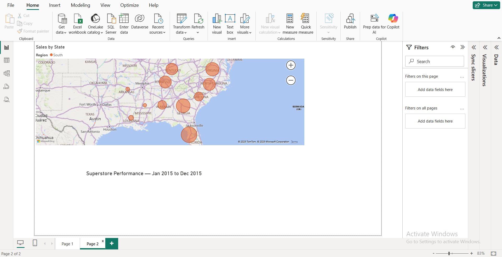

# Power BI — Superstore Dashboard

Interactive Power BI dashboard built on the Superstore dataset. It highlights Sales, Profit, Orders, and category performance with time trends, Top-N analysis, and a geographic view.

  

---

## ✨ Features

- **KPIs**: Total Sales, Profit Margin, Order Count, Total Profit
- **Time trends**: Sales vs Last Year by month (continuous timeline)
- **Category insights**: Top-N Sub-Categories by Sales (parameter-driven)
- **Profitability**: Profit by Category with conditional coloring
- **Geography**: Sales by State map with region color legend
- **Global slicers**: Region, Year (synced across pages), and **Top-N** parameter

---

## 📂 Pages

1. **Overview** — KPIs, Sales vs LY, Top-N Sub-Categories, Profit by Category  
2. **Geo** — Sales by State (bubble map), dynamic title reflects slicer selection

  

---

## 🧪 How to Run

1. Install **Power BI Desktop** (current version or 2024+ recommended).
2. Clone/download this repo and open `superstore-dashboard.pbix` in Power BI Desktop.
3. Use slicers on the left:
   - **Region** and **Year** filter all pages (synced).
   - **Top N** (numeric parameter) changes the number of sub-categories shown in the Top chart.

---

## 🧠 Key DAX (high level)

- **Sales LY**: time-intelligence measure for last year’s sales (used in the line chart).
- **Page Title**: dynamic title that renders the active date range (e.g., _“Jan 2015 to Dec 2015”_).
- **Top-N Parameter**: numeric range parameter (0–20, default 10) used by a visual-level filter:
  - **Filter type:** Top N  
  - **Show items:** Top **<Parameter Value>**  
  - **By value:** `Total Sales`

---

## 🧩 Design Notes

- **Continuous X-axis** (MonthStart) for proper time scaling.
- **Conditional bar colors** in Profit by Category (e.g., red for negative profit).
- **Synced slicers**: Region & Year work across pages for a coherent experience.
- **Responsive** layout: KPIs on top, analysis row in the middle, filters on the left.

---

## 📦 Files

- `superstore-dashboard.pbix` — the report file  
- `overview.png`, `geo.png` — screenshots for this README

---

## 🔗 Data Source

“Superstore” sample dataset (public/educational use).

---

## 📄 License

MIT License — feel free to reuse with attribution.

---

## 👤 Author

**nanoucassie** — Power BI / Data Visualization
